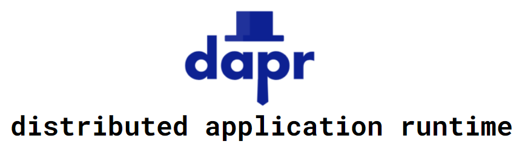
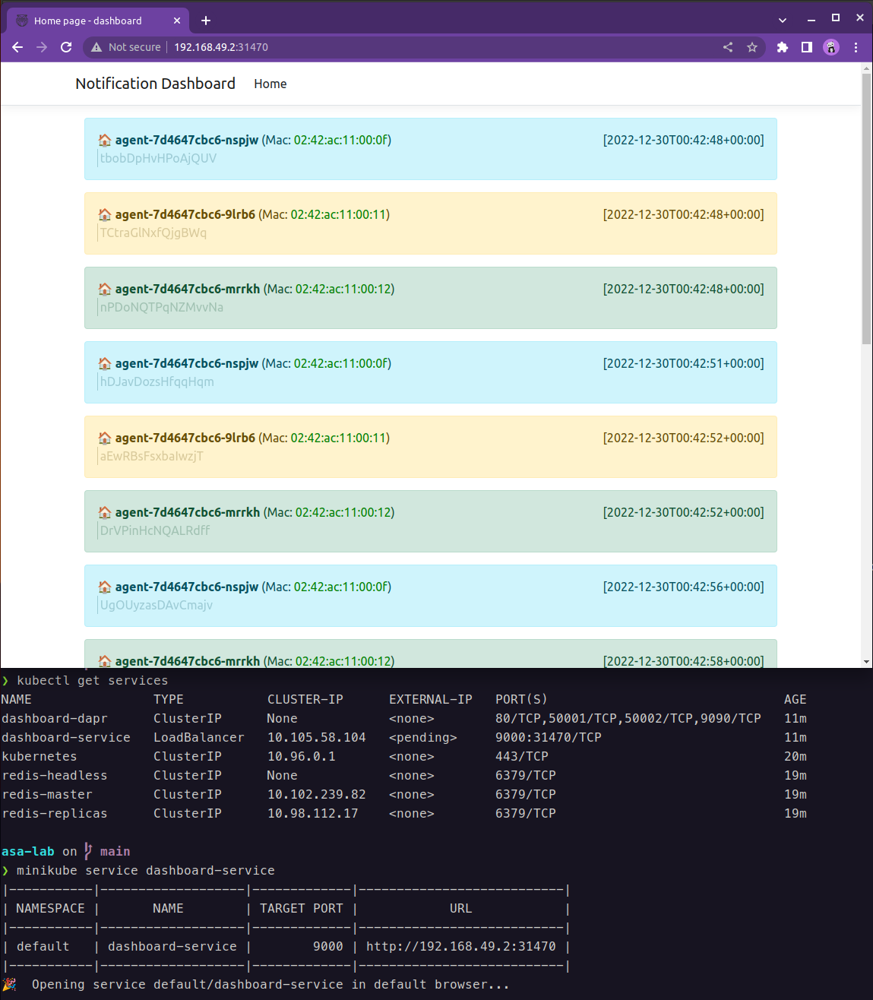

# Adaptive Architecture with dapr



**Dapr** is a portable, event-driven runtime that makes it easy for any
developer to build resilient, stateless and stateful applications that run on the cloud and edge and embraces the diversity of languages and
developer frameworks.

**Dapr** codifies the best practices for building microservice applications into open, independent, building blocks that enable you to build portable applications with the language and framework of your choice.

https://docs.dapr.io/concepts/overview/


# Setup
The following components are necessary to run the example.

- Container runtime (Docker): https://www.docker.com/get-started/
- Portable, event-driven runtime (dapr): https://docs.dapr.io/getting-started/install-dapr-cli/
- Single node k8s (minikube): https://minikube.sigs.k8s.io/docs/start/


The following components are optional, are only needed if the example is run via `apr-cli`.

- The programming language with the nice mascot **golang**: https://go.dev/dl/
- The versatile technology from Microsoft **.NET**: https://dotnet.microsoft.com/en-us/download

**NOTE**: For windows users it is quite helpful to set the execution-policy for powershell:

```bash
Set-ExecutionPolicy RemoteSigned -Scope CurrentUser
```

**NOTE**: Windows users should use a package manager to simplify installation. Scoop or Chocolaty are excellent choices.

```bash
## install scoop
irm get.scoop.sh | iex
```

# dapr cli
The installation is straight-forward, just follow the instructions mentioned above.

0. Dapr init

The first step is to initialize dapr. As a result dapr itself and the corresponding dapr runtime is installed.

**Hint**: Docker needs to run!

```bash
# kick-start dapr
dapr init

# check the version
dapr --version
CLI version: 1.7.1
Runtime version: 1.7.3
```

With this output the `dapr-cli` setup is done.

After the initial dapr setup the example can be executed using the `dapr-cli`. This is only relevant/necessary when local development and dev-sdks are available. A prerequisite for this step is the installation of the golang/.NET SDKs (again see above for the installation link/info).

1. Via Makefile (Unix-like systems)

To simplify this process open two terminal windows and execute the following make commands.

```bash
# terminal1
make agent-cli

# terminal2
make dashboard-cli
```

To verify if all works as expected open a browser windows with the following URL: ```http://localhost:9000```.

**HINT**: If you get an error concerning the port this might be caused by a process already having possession of the port :9000.

2. Via Powershell (Windows)

For the Windows-people the process works the same, open two terminal/powershell/... windows and execute the powershell scripts.

```bash
# terminal1
.\dapr-agent-cli.ps1

# terminal2
.\dapr-dashboard-cli.ps1
```

Again verify the correct execution of the processes by opening a browser window with the URL: ```http://localhost:9000```.

The output will be similar to this:


# dapr on k8s (no local development SDKs needed)

The easiest way to work with kubernetes/k8s is to locally install minikube, a single-node kubernetes "cluster". The installation is again rather simple and can be easily performed on Windows, Mac, Linux.

1. minikube

Install minikube according to documentation: https://minikube.sigs.k8s.io/docs/start/

Afterwards startup minikube. The output will be similar to the one shown below:

```bash
> minikube start

😄  minikube v1.25.2 on Darwin 12.4 (arm64)
✨  Using the docker driver based on existing profile
👍  Starting control plane node minikube in cluster minikube
🚜  Pulling base image ...
🔄  Restarting existing docker container for "minikube" ...
🐳  Preparing Kubernetes v1.23.3 on Docker 20.10.12 ...
    ▪ kubelet.housekeeping-interval=5m
🔎  Verifying Kubernetes components...
    ▪ Using image gcr.io/k8s-minikube/storage-provisioner:v5
    ▪ Using image kubernetesui/dashboard:v2.3.1
    ▪ Using image kubernetesui/metrics-scraper:v1.0.7
💡  After the addon is enabled, please run "minikube tunnel" and your ingress resources would be available at "127.0.0.1"
    ▪ Using image k8s.gcr.io/ingress-nginx/kube-webhook-certgen:v1.1.1
    ▪ Using image k8s.gcr.io/ingress-nginx/controller:v1.1.1
    ▪ Using image k8s.gcr.io/ingress-nginx/kube-webhook-certgen:v1.1.1
🔎  Verifying ingress addon...
🌟  Enabled addons: storage-provisioner, default-storageclass, dashboard, ingress
🏄  Done! kubectl is now configured to use "minikube" cluster and "default" namespace by default
```

To work with k8s/minikube `kubectl` is needed. Minikube provides a kubectl `minikube kubectl -- <kubectl commands>`. In addition it is possible to install a plain kubectl. This can be done by typical packages managers. For Windows [scoop](https://scoop.sh/) is quite nice (or winget for newer Windows versions).

```bash
# Mac
brew install kubectl

# Windows
scoop install kubectl
```

This is optional, because the minikube-provided kubectl can also be used, or aliased to "feel" like a standalone kubectl (https://minikube.sigs.k8s.io/docs/handbook/kubectl/).


2. dapr on k8s

The process is again quite easy. More information is available on the dapr website: https://docs.dapr.io/operations/hosting/kubernetes/cluster/setup-minikube/.
The following additional components are installed on minikube:

```bash
minikube addons enable dashboard
minikube addons enable ingress
```

The finial step to initialize dapr on k8s is done via the `dapr-cli`.

```bash
dapr init -k
```

This command deploys the necessary containers to have the dapr environment available on minikube.

3. dapr components pubsub

A pubsub component is needed on k8s/minikube for this example. The easiest way is to install `redis` by using the `helm-cli` (dapr-docu: https://docs.dapr.io/getting-started/tutorials/configure-state-pubsub/)

3.1 Install helm-cli

The helm-documentation lists a number of options how to install helm for different operating-systems: https://helm.sh/docs/intro/install/

3.2 Install redis

```bash
helm repo add bitnami https://charts.bitnami.com/bitnami
helm repo update
helm install redis bitnami/redis
```

Once the commands executed successfully check the relevant pods are running:

```bash
> kubectl get pods
NAME               READY   STATUS    RESTARTS      AGE
redis-master-0     1/1     Running   1 (35m ago)   2d23h
redis-replicas-0   1/1     Running   2 (34m ago)   2d23h
redis-replicas-1   1/1     Running   2 (34m ago)   2d23h
redis-replicas-2   1/1     Running   2 (34m ago)   2d23h
```

3.3 dapr pubsub component

The last step is to "introduce" the pubsub dapr component to k8s. The definition of the component is stored in `deployment/pubsub.yaml`

```yaml
apiVersion: dapr.io/v1alpha1
kind: Component
metadata:
  name: pubsub
  namespace: default
spec:
  type: pubsub.redis
  version: v1
  metadata:
  - name: redisHost
    value: redis-master.default.svc.cluster.local:6379
  - name: redisPassword
    secretKeyRef:
      name: redis
      key: redis-password
 # uncomment below for connecting to redis cache instances over TLS (ex - Azure Redis Cache)
  # - name: enableTLS
  #   value: true

```

This "typical" yaml structure is the applied via `kubectl` using the following command:

```bash
kubectl apply -f ./deployment/pubsub.yaml
```

Again this can be done by using the Makefile:

```bash
make kube-deploy-pubsub
```

Or for the Windows-people by using the following powershell script:

```bash
.\k8s-deploy-pubsub.ps1
```

The result can be verified by listing the component via `kubectl`:

```bash
> kubectl get components
NAME     AGE
pubsub   2d23h
```

4. deploy components and service

**NOTE**: We need to **build the container-images** before we can deploy the application components. The process is described in the section **Build local images**.

**TL;DR**

```bash
# unix-like
## we need to tell docker where the images are stored - this is necessary for minikube to find the images used in the pods
eval $(minikube docker-env)
make build-container

## note for M1 Mac Users
## the Makefile provides a target which sets the correct architecture for M1 Macs
make build-container-arm

# windows
## set docker-env variables to "redirect" the images towards minikube
minikube docker-env --shell powershell | Invoke-Expression
.\docker-build.ps1
```

To deploy the logic as containers to k8s/minikube another yaml definition is needed. The yaml files creates deployments for two pods and a service to access the dashboard (via ingress). The syntax is typical k8s-yaml (https://kubernetes.io/docs/concepts/overview/working-with-objects/kubernetes-objects/) with some dapr-extensions:

```yaml
annotations:
    dapr.io/enabled: "true"
    dapr.io/app-id: "dashboard"
    dapr.io/app-port: "9000"
spec:
    containers:
    - name: dashboard
      image: dapr-demo/dashboard:latest
      ports:
      - containerPort: 9000
      imagePullPolicy: Never
```

The `app-port` and `containerPort` are kind of used twice, just ensure that the same ports are used. The deployment file is available at: `deployment/components.yaml` and is applied via

```bash
kubectl apply -f ./deployment/components.yaml

# unix-like
make kube-deploy-components

# windows
.\k8s-deploy-components.ps1
```

The logs on the containers within the pods (stdout) can be shown via kubectl:

```bash
# show the agent output
kubectl logs -f --selector app=agent -c agent

# show the output of the dashboard
kubectl logs -f --selector app=dashboard -c dashboard
```

The `selector` and/or `container` need to be specified, because of the dapr [sidecar pattern](https://docs.microsoft.com/en-us/azure/architecture/patterns/sidecar). The deployed pod contains two containers. The application container and the dapr sidecar.

```bash
> kubectl logs -f dashboard-<random>-<id>
error: a container name must be specified for pod dashboard-<random>-<id>, choose one of: [dashboard daprd]
```

The log-output of the dapr sidecar can also be shown:

```bash
> kubectl logs -f dashboard-<random>-<id> -c daprd
time="2022-06-02T17:01:19.962046863Z" level=info msg="starting Dapr Runtime -- version 1.7.4 -- commit 9b3512921bb52af190a2474f3d31f39a1a7a9879" app_id=dashboard instance=dashboard-<random>-<id> scope=dapr.runtime type=log ver=1.7.4
time="2022-06-02T17:01:19.962091072Z" level=info msg="log level set to: info" app_id=dashboard instance=dashboard-<random>-<id> scope=dapr.runtime type=log ver=1.7.4
time="2022-06-02T17:01:19.962208472Z" level=info msg="metrics server started on :9090/" app_id=dashboard instance=dashboard-<random>-<id> scope=dapr.metrics type=log ver=1.7.4
time="2022-06-02T17:01:19.962333421Z" level=info msg="loading default configuration" app_id=dashboard instance=dashboard-<random>-<id> scope=dapr.runtime type=log ver=1.7.4
time="2022-06-02T17:01:19.962372471Z" level=info msg="kubernetes mode configured" app_id=dashboard instance=dashboard-<random>-<id> scope=dapr.runtime type=log ver=1.7.4
time="2022-06-02T17:01:19.962380871Z" level=info msg="app id: dashboard" app_id=dashboard instance=dashboard-<random>-<id> scope=dapr.runtime type=log ver=1.7.4

```


To access the dashboard a k8s service is defined:

```yaml
apiVersion: v1
kind: Service
metadata:
  name: dashboard-service
  labels:
    app: dashboard-service
spec:
  selector:
    app: dashboard
  ports:
  - protocol: TCP
    port: 9000
    targetPort: 9000
  type: LoadBalancer
```

The service definition exposes a TCP port which binds/forwars to the node and port of the container. This is necessary to access the system and the logic within the container from the "outside".

Minikube has a speciality, that additional work is needed to access services, because no "public IP" is created with minikube (this is different with other k8s implementations). But there is an easy way to access the service - minikube has a `tunnel` command which establishes a tunnel to the exposed service. In fact it creates a tunnel to the LoadBalancer where services are exposed (https://minikube.sigs.k8s.io/docs/commands/tunnel/)

```bash
minikube tunnel
```

The terminal-window with the `tunnel` command needs to stay opened, this enables access to the defined port on **localhost**. So if a browser-window is opened (http://localhost:9000) the dashboard HTML/SignalR UI is displayed.




## Build local images
The application images are not published to dockerhub or any other container-registry, because this would just be waste for this demo-purpose. Instead the images are held locally and k8s is instructed to **not pull** the images!

To build locally a Makefile is available:

```bash
# unix-like
make build-container

# windows
.\docker-build.ps1
```
creates the local images.


```yaml
containers:
- name: dashboard
  image: dapr-demo/dashboard:latest
  ports:
  - containerPort: 9000
  imagePullPolicy: Never
```

The important part is the **imagePullPolicy**. To actually enable this, it is not sufficient to just build the images locally, because minikube does not access those local images. As usual there is an [StackOverflow answer](https://stackoverflow.com/questions/56392041/getting-errimageneverpull-in-pods) how to give the images to minikube!

The trick is to set some relevant ENVs via minikube and build again:

```
eval $(minikube docker-env)
```

On __Windows__ and __powershell__ this translates to

```
minikube docker-env --shell powershell | Invoke-Expression
```

## Cleanup

By executing the powershell script `k8s-undeploy.ps1` or `make kube-undeploy` the resources are removed from k8s and a fresh start can be done.

This can be verified by checking the pods:

```bash
> kubectl get pods
NAME                         READY   STATUS        RESTARTS        AGE
agent-666d89fb8f-mg5wh       2/2     Terminating   1 (3m34s ago)   3m35s
dashboard-5bd6c7697f-ztbx5   2/2     Terminating   0               3m35s
redis-master-0               1/1     Running       2 (22h ago)     3d23h
redis-replicas-0             1/1     Running       3 (5m16s ago)   3d23h
redis-replicas-1             1/1     Running       3 (5m16s ago)   3d23h
redis-replicas-2             1/1     Running       3 (5m16s ago)   3d23h

```

The output shows, that the application pods are in the process of being removed from k8s.
