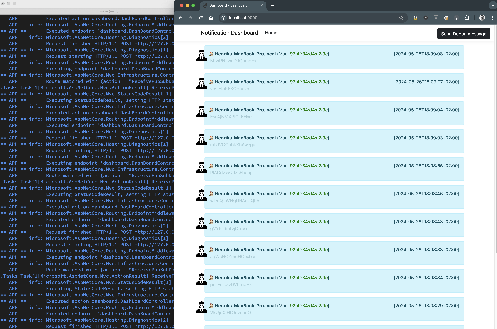

# Adaptive Architecture with dapr

Intro to dapr - https://docs.dapr.io/concepts/overview/

# Setup
The following components are necessary to run the example.

- Container runtime (Docker): https://www.docker.com/get-started/
- Portable, event-driven runtime (dapr): https://docs.dapr.io/getting-started/install-dapr-cli/
- Single node k8s (minikube): https://minikube.sigs.k8s.io/docs/start/


The following components are optional, are only needed if the example is run via `apr-cli`.

- The programming language with the nice mascot **golang**: https://go.dev/dl/
- The versatile technology from Microsoft **.NET**: https://dotnet.microsoft.com/en-us/download

# dapr cli
The installation is straight-forward, just follow the instructions mentioned above.

0. Dapr init

The first step is to initialize dapr. As a result dapr itself and the corresponding dapr runtime is installed.

**Hint**: Docker needs to run!

```bash
# kick-start dapr
dapr init

# check the version
dapr --version
CLI version: 1.7.1
Runtime version: 1.7.3
```

After the initial dapr setup the example can be executed using the `dapr-cli`. A prerequisite for this step is the installation of the golang/.NET SDKs (again see above for the installation link/info).

1. Via Makefile (Unix-like systems)

To simplify this process open two terminal windows and execute the following make commands.

```bash
# terminal1
mage agent-cli

# terminal2
make dashboard-cli
```

To verify if all works as expected open a browser windows with the following URL: ```http://localhost:9000```.

**HINT**: If you get an error concerning the port this might be caused by a process already having possession of the port :9000.

2. Via Powershell (Windows)

For the Windows-people the process works the same, open two terminal/powershell/... windows and execute the powershell scripts.

```bash
# terminal1
.\dapr-agent-cli.ps1

# terminal2
.\dapr-dashboard-cli.ps1
```

Again verify the correct execution of the processes by opening a browser window with the URL: ```http://localhost:9000```.

The output will be similar to this:



# dapr on k8s

The easiest way to work with kubernetes/k8s is to locally install minikube, a single-node kubernetes "cluster". The installation is again rather simple and can be easily performed on Windows, Mac, Linux.

1. minikube

Install minikube according to documentation: https://minikube.sigs.k8s.io/docs/start/

Afterwards startup minikube. The output will be similar to the one shown below:

```bash
> minikube start

😄  minikube v1.25.2 on Darwin 12.4 (arm64)
✨  Using the docker driver based on existing profile
👍  Starting control plane node minikube in cluster minikube
🚜  Pulling base image ...
🔄  Restarting existing docker container for "minikube" ...
🐳  Preparing Kubernetes v1.23.3 on Docker 20.10.12 ...
    ▪ kubelet.housekeeping-interval=5m
🔎  Verifying Kubernetes components...
    ▪ Using image gcr.io/k8s-minikube/storage-provisioner:v5
    ▪ Using image kubernetesui/dashboard:v2.3.1
    ▪ Using image kubernetesui/metrics-scraper:v1.0.7
💡  After the addon is enabled, please run "minikube tunnel" and your ingress resources would be available at "127.0.0.1"
    ▪ Using image k8s.gcr.io/ingress-nginx/kube-webhook-certgen:v1.1.1
    ▪ Using image k8s.gcr.io/ingress-nginx/controller:v1.1.1
    ▪ Using image k8s.gcr.io/ingress-nginx/kube-webhook-certgen:v1.1.1
🔎  Verifying ingress addon...
🌟  Enabled addons: storage-provisioner, default-storageclass, dashboard, ingress
🏄  Done! kubectl is now configured to use "minikube" cluster and "default" namespace by default
```

2. dapr on k8s

The process is again quite easy. More information is available on the dapr website: https://docs.dapr.io/operations/hosting/kubernetes/cluster/setup-minikube/.
The following additional components are installed on minikube:

```bash
minikube addons enable dashboard
minikube addons enable ingress
```

The finial step to initialize dapr on k8s is done via the `dapr-cli`.

```bash
dapr init -k
```

This command deploys the necessary containers to have the dapr environment available on minikube.

3. dapr components pubsub

A pubsub component is needed on k8s/minikube for this example. The easiest way is to install `redis` by using the `helm-cli` (dapr-docu: https://docs.dapr.io/getting-started/tutorials/configure-state-pubsub/)

3.1 Install helm-cli

The helm-documentation lists a number of options how to install helm for different operating-systems: https://helm.sh/docs/intro/install/

3.2 Install redis

```bash
helm repo add bitnami https://charts.bitnami.com/bitnami
helm repo update
helm install redis bitnami/redis
```

Once the commands executed successfully check the relevant pods are running:

```bash
> kubectl get pods
NAME               READY   STATUS    RESTARTS      AGE
redis-master-0     1/1     Running   1 (35m ago)   2d23h
redis-replicas-0   1/1     Running   2 (34m ago)   2d23h
redis-replicas-1   1/1     Running   2 (34m ago)   2d23h
redis-replicas-2   1/1     Running   2 (34m ago)   2d23h
```

3.3 dapr pubsub component

The last step is to "introduce" the pubsub dapr component to k8s. The definition of the component is stored in `deployment/pubsub.yaml`

```yaml
apiVersion: dapr.io/v1alpha1
kind: Component
metadata:
  name: pubsub
  namespace: default
spec:
  type: pubsub.redis
  version: v1
  metadata:
  - name: redisHost
    value: redis-master.default.svc.cluster.local:6379
  - name: redisPassword
    secretKeyRef:
      name: redis
      key: redis-password
 # uncomment below for connecting to redis cache instances over TLS (ex - Azure Redis Cache)
  # - name: enableTLS
  #   value: true

```

This "typical" yaml structure is the applied via `kubectl` using the following command:

```bash
kubectl apply -f ./deployment/pubsub.yaml
```

Again this can be done by using the Makefile:

```bash
make kube-deploy
```

Or for the Windows-people by using the following powershell script:

```bash
.\k8s-deploy-pubsub.ps1
```

The result can be verified by listing the component via `kubectl`:

```bash
> kubectl get components
NAME     AGE
pubsub   2d23h
```

4. deploy components and service

```bash
minikube tunnel
```


## Local images
The application images are not published to dockerhub or any other container-registry, because this would just be waste for this demo-purpose. Instead the images are held locally and k8s is instructed to **not pull** the images!

To build locally a Makefile is available:

```bash
# unix-like
make build-container

# windows
.\docker-build.ps1
```
creates the local images.


```yaml
containers:
- name: dashboard
  image: dapr-demo/dashboard:latest
  ports:
  - containerPort: 9000
  imagePullPolicy: Never
```

The important part is the **imagePullPolicy**. To actually enable this, it is not sufficient to just build the images locally, because minikube does not access those local images. As usual there is an [StackOverflow answer](https://stackoverflow.com/questions/56392041/getting-errimageneverpull-in-pods) how to give the images to minikube!

The trick is to set some relevant ENVs via minikube and build again:

```
eval $(minikube docker-env)
```

On __Windows__ and __powershell__ this translates to

```
minikube docker-env --shell powershell | Invoke-Expression
```
